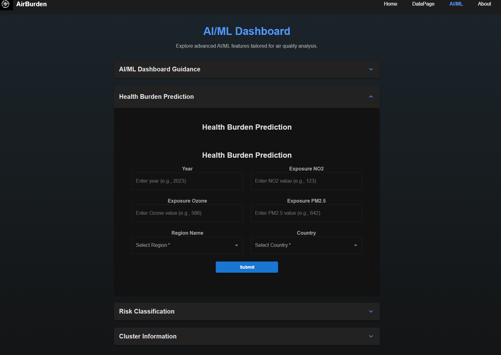
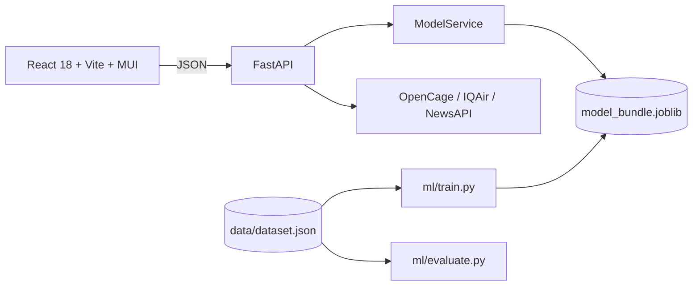

# AirBurden

**A production-style machine learning system: data validation, model training and evaluation, a containerised inference API and an interactive dashboard.**

[](https://github.com/prattaybanik03/airburden/actions/workflows/ci.yml)
    

AirBurden estimates how air-pollution exposure (NO2, ozone, PM2.5) relates to health burden across 172 countries (1990-2020). It covers the full ML lifecycle in one repository: data preparation, model training, rigorous evaluation, a validated REST API, a React dashboard, live data integrations, containerisation, automated tests and CI.



## The pipeline

| Stage | What it does | Where |
|---|---|---|
| 1. Data | Loads the State of Global Air extract, de-duplicates, builds one shared feature list | `backend/ml/data.py` |
| 2. Data quality | Detects corrupted pollutant values (~7-8% per column) | `backend/ml/data_quality.py`, [docs](docs/data-quality.md) |
| 3. Training | Random Forest regressor + classifier, K-Means profiles, saved as one joblib bundle | `backend/ml/train.py` |
| 4. Evaluation | Random vs held-out-country vs temporal splits, with trivial baselines | `backend/ml/evaluate.py`, [docs](docs/evaluation.md) |
| 5. Serving | FastAPI + Pydantic validation, `/health`, `/model_info`, timeouts and clean errors | `backend/app/` |
| 6. Product | React 18 + Vite + MUI dashboard: predictions, choropleth map, charts, dataset explorer, live AQI and health news | `frontend/` |
| 7. Delivery | Pinned lockfiles, model versioning, Dockerfiles + Compose, pre-commit, pytest suite (30 tests), ruff, GitHub Actions CI | `docker-compose.yml`, `backend/tests/`, `.github/workflows/` |

## Features

* **Health-burden regression** (Random Forest): estimated DALY rate for a country, year and exposure levels.
* **Risk classification** (Random Forest): Low / Moderate / High risk with class probabilities.
* **Exposure profiles** (K-Means, k = 3): which pollutant profile a set of exposures resembles.
* **Live air quality** by city (OpenCage geocoding + IQAir) with US EPA AQI bands, and **health news** (NewsAPI).
* **Dataset explorer** with filtering, charts and CSV export.
* Pydantic-validated API, `/health` and `/model_info` endpoints, configurable CORS, Docker Compose deployment, GitHub Actions CI.

## Architecture



More detail in [docs/architecture.md](docs/architecture.md).

## Quick start

**With Docker** (builds the model into the image):

```bash
docker compose up --build     # API: http://localhost:8000/docs   UI: http://localhost:8080
```

**Deploy**: [`render.yaml`](render.yaml) is a one-click Blueprint for free hosting; see [docs/deployment.md](docs/deployment.md).

**Local development**:

Requirements: Python 3.12, Node 20+.

```bash
# 1. backend
cd backend
python -m venv .venv && source .venv/bin/activate
pip install -r requirements-dev.lock
cp .env.example .env            # optional: add API keys for the live air-quality and news panels
python -m ml.train              # builds artifacts/model_bundle.joblib from ../data/dataset.json (a few seconds)
python -m uvicorn app.main:app --reload     # http://127.0.0.1:8000/docs

# 2. frontend (new terminal)
cd frontend
npm install
npm run dev                     # http://localhost:5175
```

The model endpoints work without any API keys. Only `/air_quality` and `/health_news` need them (they return 503 if a key is missing).

Example request:

```bash
curl -X POST http://127.0.0.1:8000/predict_health_burden -H 'Content-Type: application/json' -d '{
  "features": {"year": 1990, "exposure_mean_no2": 123, "exposure_mean_ozone": 566, "exposure_mean_pm25": 642,
               "country": "Afghanistan", "region_name": "Eastern Mediterranean Region"}}'
```

`make train`, `make evaluate`, `make test` and `make lint` wrap the common commands.

## Evaluation at a glance

| Features | Random split R² | Held-out countries R² | Temporal split R² |
|---|---|---|---|
| App features (year, country id, region id, 3 pollutants) | 0.92 | 0.31 | 0.74 |
| Pollutants only | 0.65 | 0.14 | 0.02 |
| *Baseline: last value carried forward* | n/a | n/a | **0.94** |

Reproduce with `make evaluate`.

## Repository layout

```
backend/    FastAPI app (app/), training + evaluation code (ml/), tests (tests/)
frontend/   React single-page app
data/       State of Global Air extract + data card
docs/       architecture, evaluation, data-quality finding, v1-vs-v2 write-up
```

## Revisiting my 2024 version

AirBurden began as a 2024 university project. In 2026 I went back, tested it properly, and rebuilt it. Along the way I found bugs in my original serving code
and an over-optimistic evaluation, and fixed them. The details are in [docs/v1-vs-v2.md](docs/v1-vs-v2.md); the headline:

| | 2024 version (v1) | This version |
|---|---|---|
| Afghanistan 1990, observed health burden **15,700** | service returned **1,053** | **15,533** |
| Why | model inputs were assembled in a different column order from training, and the output was un-scaled with the wrong scaler column | one shared feature list for training and serving, no scaler to invert, regression test |
| Reported performance | R² ≈ 0.92 on a random split | R² 0.92 random, **0.31 on unseen countries**; does not beat a region average or "last value carried forward" |
| Data | taken at face value | ~7-8% of each pollutant column is corrupted in the source extract ([details](docs/data-quality.md)) |
| Tests | none | 30 backend tests + CI |

The full evaluation, with baselines, is in [docs/evaluation.md](docs/evaluation.md). In short: a random split on panel data lets the model recognise
*which country it is looking at*. On countries it has never seen, pollutant exposure adds little. I'd rather show that than hide it.

## Limitations and roadmap

* This is an **exploratory** model on ecological, country-level data. It is not a validated health tool and the API says so in every response.
* Re-source the dataset from the publisher and fix the corrupted pollutant values ([docs/data-quality.md](docs/data-quality.md)).
* Try within-country (panel / fixed-effects) modelling and add covariates such as income and age structure.
* Frontend: code-split the 7.8 MB bundle (Plotly + dataset), clear the inherited lint errors, replace the unmaintained `react-swipeable-views`.

## Data and attribution

Air-pollution exposure and health-burden estimates come from the **State of Global Air** (Health Effects Institute, with IHME). See
[data/README.md](data/README.md) for details and a known data issue, and check the publisher's current terms at <https://www.stateofglobalair.org>.

## Credits

Originally a group assignment for COS30049 (Computing Technology Innovation Project) at Swinburne University of Technology. I designed and built the application
and models; Christine Bong and William Bakos were my teammates on the unit, and I'm grateful for their help.

Released under the [MIT License](LICENSE).
