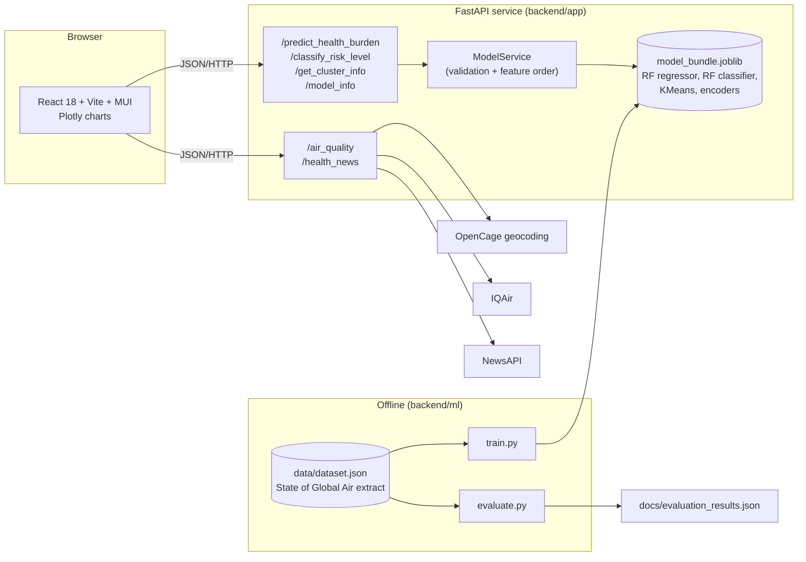

# Architecture

## Components

| Path | Role |
|---|---|
| `frontend/` | Single-page app. Reads `VITE_BACKEND_URL`. The dataset is imported from `data/` for the explorer pages. |
| `backend/app/` | FastAPI app: routers, Pydantic schemas, `ModelService`, env-based settings. |
| `backend/ml/` | `data.py` (loading, features), `train.py` (writes `artifacts/`), `evaluate.py` (splits + baselines). |
| `backend/artifacts/` | Generated by `make train`. Git-ignored: models are rebuilt from data, never committed. |
| `data/` | Source extract with attribution. |
| `docs/` | Architecture, evaluation, v1-vs-v2 write-up. |

## Models

| Model | Type | Inputs | Output |
|---|---|---|---|
| Health burden | Random Forest regressor (200 trees) | year, country id, region id, NO2, ozone, PM2.5 | DALY rate |
| Risk level | Random Forest classifier (200 trees) | same | Low / Moderate / High (terciles of the training target) plus probabilities |
| Exposure profile | K-Means (k = 3) on standardised pollutants | NO2, ozone, PM2.5 | cluster id, label, centroid |

## Design decisions

* **One feature list** (`ml/data.py::FEATURES`) is imported by training, evaluation and serving. The column order cannot drift.
* **Artifacts are rebuilt, not committed.** A pickled model is tied to library versions, so `make train` regenerates it, and the bundle
  records the scikit-learn version it was built with.
* **Validation at the edge.** Unknown countries and country/region mismatches are rejected with 422 instead of silently encoding garbage.
* **External calls are isolated** in one router with timeouts and clean error mapping, so the model endpoints work without any API keys.
